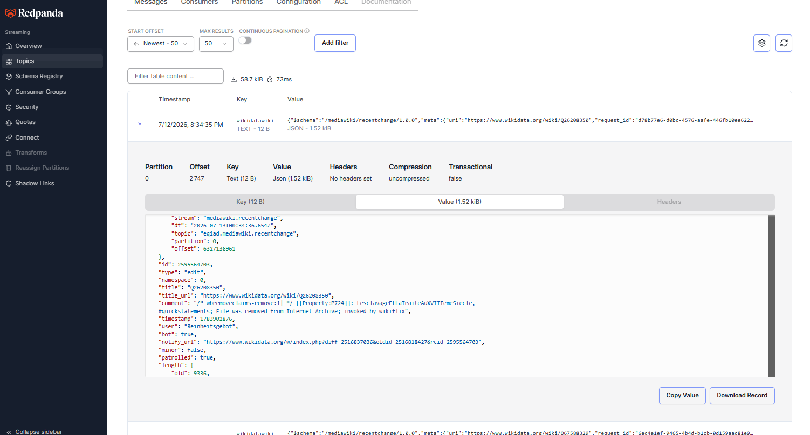

# 📡 Wikipedia Streams

> A real-time Kafka Streams pipeline in **Kotlin** — ingesting live Wikipedia edit events via Server-Sent Events, processing them through stateful windowed topologies, and serving analytics through a REST API.

**Data flows:** Wikimedia SSE → Kafka (Redpanda) → Kafka Streams (Kotlin) → Ktor REST API

---

## What This Project Demonstrates

This is the **JVM/Kotlin chapter** of a data engineering portfolio. It explores concepts that are either impossible or impractical in the Python-based streaming world:

| Concept | How It's Shown Here |
|---|---|
| **Kafka Streams topology DSL** | Declarative stream processing DAG — not a polling loop |
| **KTables** | Changelog-backed materialized views representing current state per key |
| **Tumbling windows** | Non-overlapping 1-minute buckets for edit velocity per wiki |
| **Hopping windows** | Overlapping 5-minute windows for "hot pages right now" |
| **RocksDB state stores** | Framework-managed persistent local state — no external database |
| **Interactive queries** | Query in-process state stores directly via REST, no Kafka round-trip |
| **SSE ingestion** | Server-Sent Events — simpler than WebSocket for unidirectional feeds |
| **Kotlinx.serialization** | Type-safe JSON with compile-time serialization |
| **TopologyTestDriver** | Unit test stream topologies without a running Kafka cluster |
| **Exactly-once semantics** | Transactional processing guarantee via `EXACTLY_ONCE_V2` |

---

## Architecture

```
Wikimedia SSE stream (stream.wikimedia.org/v2/stream/recentchange)
  ~1000 edits/minute across all languages — free, no API key
        │
        ▼
  WikiProducer.kt (Ktor SSE client, Kotlin coroutine)
  Filters: article-space edits only (namespace = 0)
  Key: wiki name (e.g. "enwiki") — enables per-wiki aggregation without shuffle
        │
        ▼
  Kafka topic: wiki.raw-edits  (Redpanda, Docker)
        │
        ▼
  WikiTopology.kt (Kafka Streams)
  ┌─────────────────────────────────────────────────────────────────┐
  │  KStream<wiki, WikiEdit>                                        │
  │       │                                                         │
  │       ├── groupByKey → tumblingWindow(1 min)                    │
  │       │     └─► KTable: edit counts per wiki/minute             │
  │       │         State store: "edit-counts-store"                │
  │       │                                                         │
  │       ├── selectKey(wiki|title) → hoppingWindow(5min, 1min)     │
  │       │     └─► KTable: edit counts per page (last 5 min)       │
  │       │         State store: "hot-pages-store"                  │
  │       │                                                         │
  │       └── groupByKey → aggregate(BotRatioState)                 │
  │             └─► KTable: running bot vs human ratio per wiki     │
  │                 State store: "bot-ratio-store"                  │
  └─────────────────────────────────────────────────────────────────┘
        │
        ▼
  Ktor REST API (port 8090)
  GET /api/health        — pipeline liveness
  GET /api/stats         — edit counts across all wikis (last 2 min)
  GET /api/stats/{wiki}  — edit counts for a specific wiki
  GET /api/hot-pages     — most-edited articles in the last 5 minutes
  GET /api/bot-ratio     — cumulative bot vs human split per wiki
```

---

## Tech Stack

| Layer | Tool |
|---|---|
| Language | Kotlin 2.0 (JVM 21) |
| Build | Gradle with Kotlin DSL |
| Message broker | Redpanda (Kafka-compatible) via Docker Compose |
| SSE ingestion | Ktor client (CIO engine) |
| Stream processing | Apache Kafka Streams 3.8 |
| State stores | RocksDB (embedded in Kafka Streams) |
| REST API | Ktor server (Netty engine) |
| Serialization | Kotlinx.serialization |
| Logging | kotlin-logging + Logback |
| Tests | JUnit 5 + kafka-streams-test-utils |

---

## Setup

**Prerequisites:** Docker Desktop, JDK 21+ — no Gradle install needed (the wrapper `./gradlew` is included)

```bash
# 1. Enter the project
cd repositories/data-engineer-wiki-streams

# 2. Start Kafka (Redpanda)
docker compose up -d

# 3. Copy environment config (defaults work out of the box)
copy .env.example .env   # Windows
# cp .env.example .env   # Mac/Linux

# 4. Run the pipeline (builds automatically on first run)
./gradlew run
```

---

## Running the Pipeline

```bash
./gradlew run
```

This starts all three components in one process:
- **WikiProducer** — connects to Wikimedia SSE and streams edits into Kafka
- **Kafka Streams** — processes the topology continuously in background threads
- **Ktor API** — serves HTTP on port 8090

Allow ~15 seconds for Kafka Streams to reach `RUNNING` state on first start.

**Redpanda Console** (Kafka UI): http://localhost:8080



---

## API Examples

```bash
# Health check
curl http://localhost:8090/api/health

# Edit velocity across all wikis (last 2 minutes)
curl http://localhost:8090/api/stats | jq .

# Edit velocity for English Wikipedia specifically
curl http://localhost:8090/api/stats/enwiki | jq .

# Most edited articles in the last 5 minutes
curl http://localhost:8090/api/hot-pages | jq .

# Bot vs human edit ratio per wiki
curl http://localhost:8090/api/bot-ratio | jq .
```

Sample `/api/hot-pages` response:
```json
[
  {
    "wiki": "enwiki",
    "title": "2024 United States elections",
    "editCount": 12,
    "windowStartIso": "2024-01-15T10:00:00Z",
    "windowEndIso": "2024-01-15T10:05:00Z"
  }
]
```

---

## Tests

```bash
./gradlew test
```

**16 tests, no Kafka broker required:**

**Topology tests** (`WikiTopologyTest`) — use `TopologyTestDriver` to test the full stream processing DAG in-process:

| Test | What it verifies |
|---|---|
| `edit count increments` | Tumbling window counts correctly |
| `edits in different wikis` | Per-wiki isolation in aggregations |
| `non-article namespace filtered` | Namespace 0 filter works |
| `log events filtered` | Only edit/new types pass |
| `bot ratio accumulates` | BotRatioState arithmetic (40% = 2 bots / 5 total) |
| `hot pages counted per page` | Hopping window per-page accumulation |
| `malformed JSON dropped` | Topology survives bad input without crashing |

**Producer tests** (`WikiProducerTest`) — test SSE event parsing and filtering logic:

| Test | What it verifies |
|---|---|
| `valid edit event parsed` | WikiEdit deserialization |
| `bot flag parsed` | True/false bot field |
| `unknown extra fields ignored` | `ignoreUnknownKeys` in action |
| `article-space edits forwarded` | type=edit, namespace=0 passes |
| `new page events forwarded` | type=new passes |
| `log / categorize / external filtered` | Non-edit types dropped |
| `talk / project / user pages filtered` | Non-zero namespaces dropped |
| `bot edits forwarded` | Bots tracked for ratio metric |

---

## Key Concepts Explained

### KStream vs KTable
A **KStream** is an unbounded log of events — every Wikipedia edit is one record. A **KTable** is a changelog-compacted view — only the latest value per key is kept, representing *current state*. Aggregations (count, sum, custom) convert a KStream into a KTable.

### Tumbling vs Hopping Windows
- **Tumbling (1 min):** non-overlapping buckets. An edit at 10:00:45 goes into the `[10:00, 10:01)` bucket only. Used for "how many edits happened in this specific minute."
- **Hopping (5 min, advance 1 min):** overlapping. That same edit appears in 5 consecutive windows: `[09:56, 10:01)`, `[09:57, 10:02)`, ..., `[10:00, 10:05)`. Used for "what pages are hot *right now* (last 5 minutes)."

### State Stores & Interactive Queries
Kafka Streams persists aggregation state to local **RocksDB** instances. Rather than writing results to an external database and querying that, the Ktor API queries the in-process state stores directly via `streams.store(...)`. This eliminates a database dependency and gives sub-millisecond query latency.

### SSE vs WebSocket
Server-Sent Events (SSE) is a simpler HTTP/1.1 protocol for unidirectional server→client push. The client makes one HTTP GET request and reads a continuous stream of `data: {...}` lines. No handshake protocol, no binary framing — just text over a persistent HTTP connection. Wikimedia uses it for their public change feed.

### Exactly-Once Semantics
With `EXACTLY_ONCE_V2`, Kafka Streams wraps each batch of reads + state updates + output writes in a Kafka transaction. If the process crashes mid-batch, the transaction is rolled back and reprocessed — no duplicates, no data loss.

---

## Project Comparison

| | `finance-analytics` | `crypto-streaming` | **This project** |
|---|---|---|---|
| Language | Python | Python | **Kotlin (JVM)** |
| Processing model | Batch (daily) | Micro-batch (30s) | **Continuous streaming** |
| Ingestion | CSV/REST API | WebSocket | **SSE** |
| Processing framework | dbt | Custom loop | **Kafka Streams** |
| State management | BigQuery / DuckDB | DuckDB + Parquet | **RocksDB (embedded)** |
| Windowing | SQL GROUP BY | Manual date_trunc | **First-class API** |
| Serving layer | Evidence dashboard | Streamlit | **REST API** |
| Cost | Cloud (BigQuery) | Local | **Local** |
